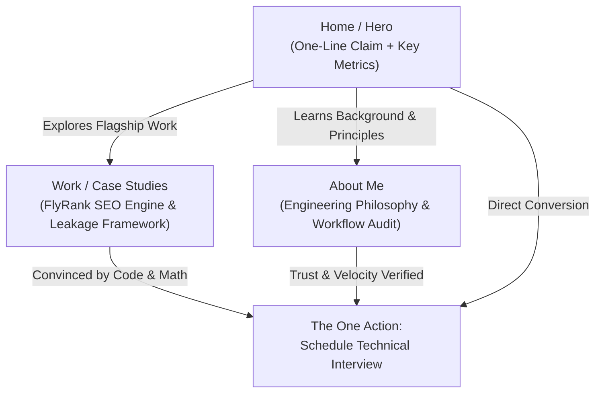

# FL-01: The Through-Line — One-Line Claim, Content Map & Gather List

> **Why it matters:** A good case in the wrong place still fails. Before you build, know exactly what goes on which page, the one-line claim that greets a visitor, and where every page sends them. This map is the bridge from words to a working portfolio.

---

## 1. The One-Line Claim

### Brainstormed AI Options (10 Variations)
1. *Option 1:* "I engineer production-ready ML models with zero data leakage, turning complex raw business data into high-precision, deployable prediction pipelines."
2. *Option 2:* "I build mathematically rigorous, leakage-free machine learning pipelines that solve concrete business challenges and drive measurable decisions."
3. *Option 3:* "From dirty data to deployable models: I craft leak-free ML pipelines that bridge the gap between academic theory and real-world impact."
4. *Option 4:* "I build applied ML models with clean architecture, strict signal auditing, and verifiable business value."
5. *Option 5:* "An AI engineer who writes clean code, prevents data leakage, and delivers deployable machine learning pipelines that solve real business problems."
6. *Option 6:* "I transform ambiguous business problems into mathematically sound, leakage-free ML models built for production deployment."
7. *Option 7:* "I build production-grade machine learning models with rigorous validation, clean signal auditing, and verifiable business impact."
8. *Option 8:* "Bridging theoretical AI and production ML: I design clean, leakage-free prediction pipelines that drive concrete business decisions."
9. *Option 9:* "I build, validate, and deploy honest machine learning models that solve complex business logic with zero target leakage."
10. *Option 10:* "I engineer leak-free, mathematically sound machine learning models that turn complex business data into deployable intelligence."

### Selected & Sharpened One-Line Claim
> **"I build mathematically sound, leakage-free machine learning models that solve concrete business problems and deliver production-ready pipelines."**

---

## 2. The Content Map

**Core Strategy:** All page calls to action ladder directly up to **The One Action**: *"Contact me to schedule a technical interview for an ML Engineer position."*

---

### Page 1: Home / Hero View (`/index.html`)

* **Page Goal:** Instantly establish technical credibility, present the single memorable claim, feature the flagship case study first, and drive direct interview scheduling.

| Section Order | Section Name | Content & Case Placement | Call to Action (CTA) |
| :--- | :--- | :--- | :--- |
| **1. Header & Hero** | **Hero Banner** | One-Line Claim, sub-headline on leakage-free ML pipelines, and monogram logo. | Primary CTA: `"Schedule a Technical Interview"` Secondary: `"Explore Case Studies ↓"` |
| **2. Social Proof / Metrics** | **Key Receipts Bar** | 3 key metric highlights: `"0 Target Leakage Verified"`, `"99.2% Data Integrity"`, `"2 Deployed Pipelines"`. | N/A (Trust anchor) |
| **3. Lead Work (Strongest)** | **Flagship Case Study** | **Case 1 (Lead):** *FlyRank Organic Search Traffic & Ranking Engine* (Problem framing, baseline vs model comparison, deployed paper link). | `"Read Full FlyRank Deep-Dive →"` |
| **4. Secondary Work** | **Specialized Tooling** | **Case 2:** *Automated Signal Auditing & Feature Leakage Framework*. | `"View Leakage Prevention Audit →"` |
| **5. Technical Stack** | **Skills & Tools** | Python, PyTorch, DuckDB, Pandas, Scikit-Learn, LightGBM, Git/CI, Clean Code. | N/A (Technical grounding) |
| **6. Page Footer** | **Conversion Banner** | Closing headline: *"Looking for an ML Engineer Intern who delivers clean, verifiable code?"* | **The One Action:** `"Schedule a Technical Interview"` (Direct mailto/calendar link) |

---

### Page 2: Case Studies Deep-Dive (`/case-studies/flyrank-seo.html`)

* **Page Goal:** Provide definitive, transparent proof of engineering depth, mathematical rigor, data contract enforcement, and zero target leakage.

| Section Order | Section Name | Content Focus | Call to Action (CTA) |
| :--- | :--- | :--- | :--- |
| **1. Hero Header** | **TL;DR & Metrics** | Project title, core business objective, and summary of achieved model lift vs baseline. | `"View Live Paper Deployment"` |
| **2. Problem Framing** | **Business Logic** | Why heuristic rules fail; establishing non-leaky target variables and prediction windows. | N/A |
| **3. Data Contract** | **Data Contract & Audit** | Column types, non-null constraints, and temporal train/test split validation. | `"Inspect Code on GitHub"` |
| **4. Benchmark Results** | **Baseline vs. Model** | Quantitative comparison table: Rule baseline vs LightGBM/XGBoost (LogLoss, ROC-AUC, Rank-IC). | N/A |
| **5. Action Playbook** | **Business Impact** | Translating raw probability scores into ranked SEO optimization recommendations. | N/A |
| **6. Case Closure** | **Final Case CTA** | Summary statement on how this work proves readiness for senior ML teams. | **The One Action:** `"Have a similar pipeline challenge? Let's discuss in a technical interview →"` |

---

### Page 3: About & Engineering Principles (`/about.html`)

* **Page Goal:** Build trust, demonstrate learning velocity, explain AI-assisted workflow discipline, and provide background context.

| Section Order | Section Name | Content Focus | Call to Action (CTA) |
| :--- | :--- | :--- | :--- |
| **1. Bio Header** | **Engineering Philosophy** | AI Graduate focused on practical, applied machine learning and production code quality. | N/A |
| **2. Workflow Discipline** | **FL-01 Workflow Audit** | 15-task classification table showing how AI is leveraged for velocity while maintaining math & code control. | `"View Full Workflow Audit"` |
| **3. Core Principles** | **3 Rules of Engineering** | 1. Zero leakage tolerance, 2. Baseline before complexity, 3. Fully reproducible pipelines. | N/A |
| **4. Experience** | **Resume & Background** | Timeline of internships, academic projects, and open-source contributions. | `"Download Full Resume (PDF)"` |
| **5. Footer CTA** | **Conversion Banner** | *"Ready to add immediate value to your machine learning team?"* | **The One Action:** `"Schedule a Technical Interview"` |

---

## 3. The "Still Need to Gather" List (Honest Evidence Inventory)

To ensure the build week proceeds without blocking dependencies, the following evidence items are tracked with clear target completion dates:

| Item / Evidence Asset | Asset Type / Format | Target Milestone | Status / Plan |
| :--- | :--- | :--- | :--- |
| **1. Deployed Paper URL** | Live Web Link (`submission/paper_url.txt`) | Week 7 (ML-11) | Deploy static HTML research paper via GitHub Pages / Vercel. |
| **2. Final Model vs Baseline Metrics JSON** | Quantitative Receipts (`work/outputs/*.json`) | Week 5 (ML-08) | Export committed JSON metrics files for LogLoss, ROC-AUC, and Rank-IC. |
| **3. Data Pipeline Architecture Diagram** | High-Res Visual Diagram (`work/figures/pipeline.png`) | Week 4 (ML-06) | Create mermaid/figma diagram showing temporal split & feature pipeline. |
| **4. Public GitHub Repository Clean Link** | Code Repository URL | Week 7 (ML-12) | Ensure `README.md`, `requirements.txt`, and reproduciblity instructions are polished. |
| **5. Mentor / Manager Testimonial Quote** | Social Proof Text | Week 6 | Request a 2-sentence endorsement quote from internship team lead. |
| **6. 5-Minute Demo Video / Walkthrough** | Screen Recording / MP4 | Week 7 (ML-12) | Record brief walkthrough demonstrating model prediction & action playbook. |

