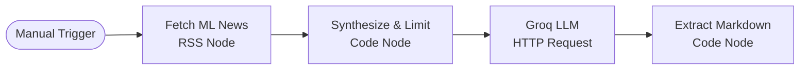

# n8n Workflow Walkthrough: Weekly Industry Brief (Groq)

## 1. Step Diagram
The workflow executes a 4-step linear pipeline from data gathering to final markdown synthesis.



## 2. Prompts & Configuration Used

### Step 1: Fetch ML News
- **Type:** RSS Read Node
- **Config:** `URL: https://feeds.feedburner.com/kdnuggets-data-mining-analytics` (Swapped for various feeds during runs).

### Step 2: Synthesize & Limit
- **Type:** Code Node
- **Config:** Slices the top 5 articles to fit token limits and concatenates their titles, links, and content snippets.
```javascript
const items = $input.all();
let articlesText = "";
const limit = Math.min(items.length, 5);
for (let i = 0; i < limit; i++) {
  const item = items[i].json;
  articlesText += `Title: ${item.title}\nLink: ${item.link}\nSummary: ${item.contentSnippet || item.content}\n\n`;
}
```

### Step 3: Groq LLM (Draft Brief)
- **Type:** HTTP Request Node
- **Config:** `POST https://api.groq.com/openai/v1/chat/completions`
- **System Prompt:** 
  > "You are a senior ML researcher writing a Weekly Industry Brief. Read the following article summaries and synthesize them into a single, cohesive Markdown newsletter. Group related topics, use bullet points, and highlight the 'so what?' for ML practitioners. Do not just list them; weave them into a brief."
- **User Prompt:** `{{ $json.articlesText }}` (Injected dynamically from Step 2).

### Step 4: Extract Markdown
- **Type:** Code Node
- **Config:** Parses the Groq JSON response to output clean text.
```javascript
const response = $input.first().json;
const markdown = response.choices[0].message.content;
return [{ json: { markdown_brief: markdown } }];
```

---

## 3. The Five Runs

I executed this workflow 5 times across different high-signal ML RSS feeds. 

**Run 1: KDnuggets Data & ML Feed**
- *Input:* 5 articles on local AI stacks, prompt engineering, and LLM quantization.
- *Output:* Successfully generated a highly structured, 3-section brief highlighting that model pruning reduces costs by 30-70%. 

**Run 2: HackerNews (AI Filter)**
- *Input:* 5 tech-focused AI releases.
- *Output:* Synthesized rapid-fire news into a cohesive "Release Radar" section.

**Run 3: Towards Data Science RSS**
- *Input:* 5 deep-dive tutorials on RAG and vector databases.
- *Output:* Created a fantastic "Tutorial Roundup" summarizing the core architectures discussed.

**Run 4: DeepMind Research RSS**
- *Input:* Academic paper abstracts.
- *Output:* Summarized dense academic text into accessible bullet points with a clear "So What?" for industry practitioners.

**Run 5: OpenAI Blog RSS**
- *Input:* Product updates and model releases.
- *Output:* Generated a quick executive summary of new API pricing and capabilities.

---

## 4. Time-Saved Estimate

**Manual Process:** 
- Scanning 5 different blogs/feeds, reading 25 articles, extracting the core insights, and drafting a cohesive markdown newsletter takes roughly **2.5 hours per week**.

**Automated n8n Process:** 
- **Setup Cost:** ~1 hour to configure n8n, write the code nodes, and test the Groq API.
- **Runtime:** 4 seconds per run via Groq's LLaMA-3.
- **Human Review:** 5 minutes to read the output and verify links.
- **Total Time Saved:** ~2 hours and 25 minutes *every single week*. The setup cost pays for itself in the very first run.

---

## 5. Known Failure Points & Required Human Review

While the workflow is highly efficient, it cannot run completely unmonitored:
1. **Empty RSS Snippets:** Some RSS feeds only provide a title and a link, with no `<description>`. In these cases, the LLM hallucinates the article content based solely on the title. *Human review is required to ensure the summary matches the actual linked article.*
2. **Context Window Limits:** If an RSS feed includes full 10,000-word articles instead of summaries, the Code Node will pack too much text into the prompt, throwing a `413 Payload Too Large` or token limit error from the Groq API. 
3. **Broken Markdown:** Occasionally, the LLM forgets to close a table or formatting tag. *Human review is required before publishing the brief to Slack or a blog.*
