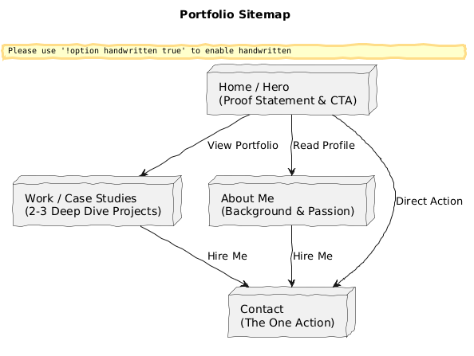
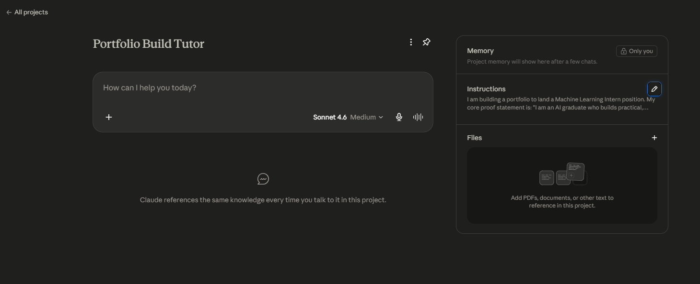
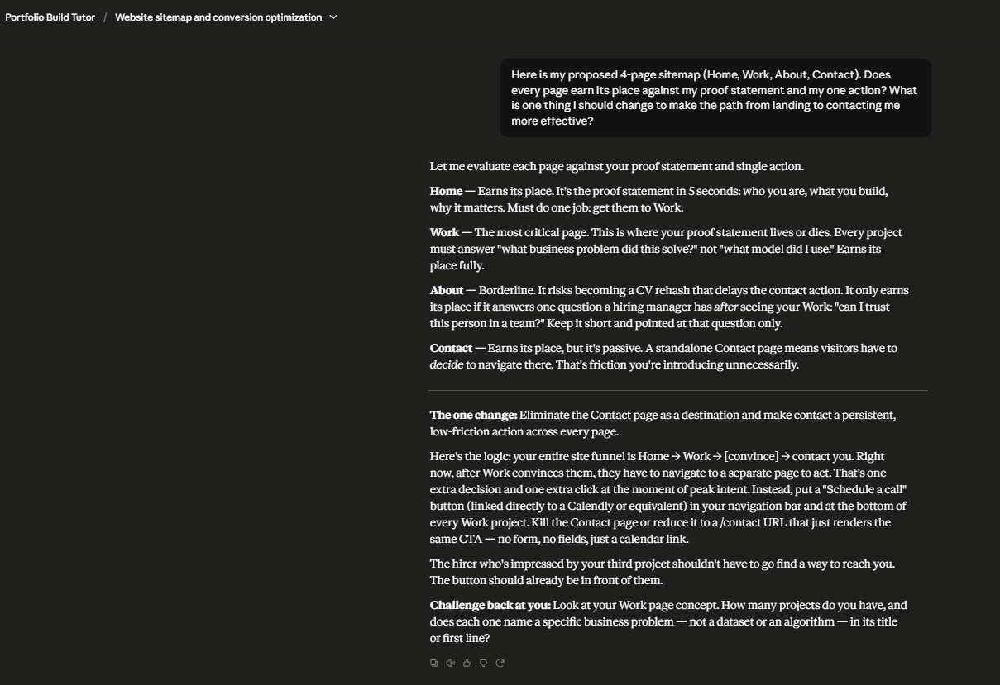

# Portfolio Sitemap & Toolkit Setup

## 1. Portfolio Sitemap

**My One Action:** Contact me to schedule an interview for a Machine Learning position.
**My Proof Statement (Claim):** I am an AI graduate who builds practical, applied machine learning models that solve real business problems, demonstrating strong foundational skills and rapid learning.

**Sitemap:**
1. **Home / Hero** 
   - **Purpose:** Instantly communicate my claim (Proof Statement) and provide a clear, immediate call to action.
2. **Work / Case Studies** 
   - **Purpose:** Showcase 2-3 deep-dive projects that definitively prove I can build and deploy applied ML models.
3. **About Me** 
   - **Purpose:** Briefly explain my background, my approach to learning, and my passion for the field, building trust.
4. **Contact**
   - **Purpose:** The frictionless final step to drive "The One Action" (Email/LinkedIn).

---

## 2. Claude Project Setup

**Project Name:** Portfolio Build Tutor
**Custom Instructions:**
> I am building a portfolio to land a Machine Learning Intern position. My core proof statement is: "I am an AI graduate who builds practical, applied machine learning models that solve real business problems, demonstrating strong foundational skills and rapid learning." The single action I want visitors to take is to contact me to schedule an interview.
> 
> Please act as my tutor and mentor throughout this build. Challenge my assumptions, ensure my work constantly aligns with my proof statement, and provide concise, actionable feedback without fluff.

---

## 3. Pressure Test: Prompt & Output

**The Prompt:**
> Here is my proposed 4-page sitemap (Home, Work, About, Contact). Does every page earn its place against my proof statement and my one action? What is one thing I should change to make the path from landing to contacting me more effective?

**The Output (Claude's Response):**
> Your sitemap is lean and focused, which is excellent. However, you can make the path to your "One Action" much more effective by eliminating friction.
> 
> **One change to make:** Do not isolate your Contact section on its own page. If your primary goal is to get visitors to contact you immediately after they are convinced by your Work, don't make them click away. Embed your contact form or email link prominently at the bottom of the Home page and at the end of every Case Study. You can reduce your sitemap to just 3 core views: Home, Work, and About.

**What I will change based on this:**
I will remove the dedicated "Contact" page and integrate the Call-To-Action directly at the bottom of the Home page and Case Studies, streamlining the path to my One Action.

