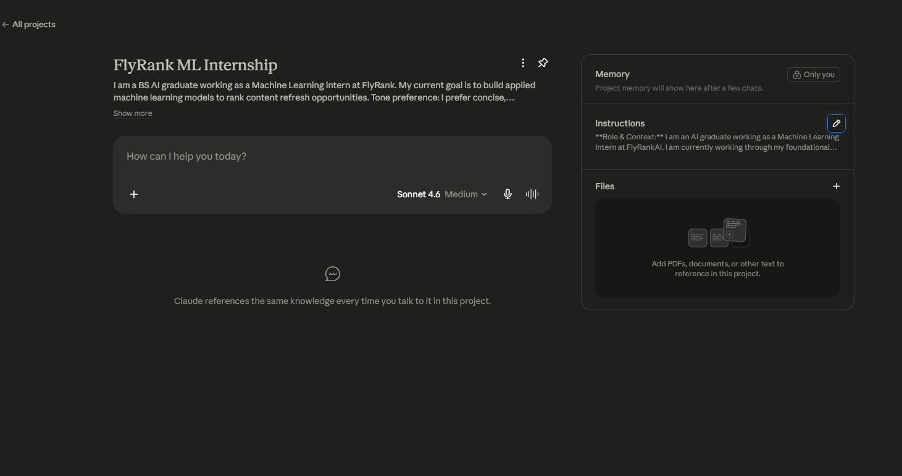

# FL-01: Workflow Audit

## 1. Recurring Weekly Tasks (10-15 Tasks)

| Task | Classification | Rationale |
| :--- | :--- | :--- |
| **1. Reading ML research papers** | Just me | I need to personally absorb the math, intuition, and architectural details; AI summaries often miss the nuances I care about. |
| **2. Final code review for model logic** | Just me | I am ultimately accountable for the model's correctness and preventing target leakage; I must verify the logic manually. |
| **3. Writing boilerplate data cleaning code** | Delegate to AI with review | AI is incredibly fast at writing regex or pandas `fillna` logic; I just review to ensure it handles edge cases correctly. |
| **4. Drafting routine emails/updates** | Delegate to AI with review | Speeds up communication; I just tweak the tone before hitting send. |
| **5. Writing Git commit messages** | Delegate to AI with review | Passing the `git diff` to an AI generates clean, standardized messages much faster than I can. |
| **6. Formatting Matplotlib/Seaborn charts** | Delegate to AI with review | Tweaking plot aesthetics (colors, legends, axis labels) is tedious; AI gets it 90% right on the first try. |
| **7. Debugging model training errors** | Collaborate with AI | Bouncing stack traces and hypotheses off an AI helps me get unstuck much faster than Googling. |
| **8. Brainstorming feature engineering** | Collaborate with AI | AI is great at suggesting domain-specific features I might not have thought of, which we then refine together. |
| **9. Learning new libraries (e.g., DuckDB)** | Collaborate with AI | Asking targeted questions and having it generate interactive examples is faster than reading standard docs. |
| **10. Planning project architecture/pipelines** | Collaborate with AI | Useful for whiteboarding; I provide constraints, it provides a draft structure, and we iterate. |
| **11. Organizing daily task lists/notes** | Fully Automate | AI can take my messy brain-dump notes and instantly convert them into an organized markdown checklist. |
| **12. Setting up Python environments** | Fully Automate | A simple automated bash/makefile script handles all dependency and virtual environment setups instantly. |
| **13. Creating presentation slides for weekly sync** | Collaborate with AI | AI helps structure the narrative and bullet points from my raw notes. |
| **14. Reviewing PRs from peers** | Just me | I need to understand their code changes deeply to ensure system integrity and learn from their approaches. |
| **15. Updating personal portfolio website** | Delegate to AI with review | AI can quickly generate HTML/CSS updates or new project cards based on my text descriptions. |

---

## 2. Target Tasks for FL-02 through FL-04

*(These are three tasks chosen from above that will be refined and mapped in future modules).*

**Target Task 1: Debugging model training errors**
* **Success Definition ("Done Well"):** The AI correctly identifies the root cause of the error (e.g., shape mismatch, memory leak) from the stack trace and provides a working code fix on the first or second attempt, reducing debugging time from hours to minutes.

**Target Task 2: Brainstorming feature engineering**
* **Success Definition ("Done Well"):** The AI provides at least 3 mathematically sound and leakage-free feature ideas tailored specifically to the dataset's domain, including the pandas/SQL logic to implement them.

**Target Task 3: Formatting Matplotlib/Seaborn charts**
* **Success Definition ("Done Well"):** The AI returns clean Python code that produces a presentation-ready, aesthetically pleasing chart (proper labels, colors, and titles) without requiring more than one manual syntax fix.

---

## 3. Evidence of Setup

