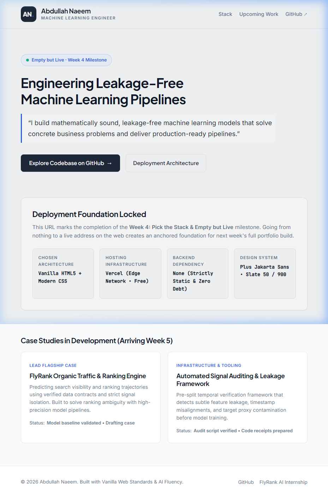

# Architecture Rationale: The Stack for My ML Portfolio

### The Constraints
- **Budget:** $0 (Free hosting and tools only).
- **Skill Level:** Strong in Python, data pipelines (Postgres, Pandas, PyTorch), and ML infrastructure. I know basic HTML/CSS/JS, but I am not a frontend React/web developer.
- **Display Needs:** My portfolio needs a Home page, an About page, and long-form Case Studies (e.g., FlyRank SEO Engine). It must clearly render code blocks, image galleries, and embedded Jupyter notebook outputs or demo videos.
- **Dynamic Needs:** Everything is read-only. I don't have user logins, live databases, or complex server states. Therefore, **no backend is needed yet.**

### The 3 Roads Considered
**1. Simplest: Markdown Static Site Generator (MkDocs/Hugo) on GitHub Pages**
- **How to build:** Write content in raw Markdown, let a Python or Go engine compile it to HTML.
- **Host:** GitHub Pages (Free).
- **Backend:** None.
- **Trade-off:** Very fast to write, but customizing the layout to match my specific Week 3 Identity Kit (Plus Jakarta Sans, exact slate color hexes) means fighting the default theme. Custom image galleries can be clunky.

**2. Middle Road: Vanilla HTML/CSS/JS hosted on Vercel**
- **How to build:** Hand-code the HTML structures and apply the CSS variables from my identity kit directly via a single stylesheet.
- **Host:** Vercel (Free Hobby Tier).
- **Backend:** None.
- **Trade-off:** Slower to write the initial page boilerplate than Markdown, but it gives me 100% control over the exact layout, image galleries, and custom typography without having to learn or fight a framework.

**3. Most Powerful: Next.js (React) hosted on Vercel**
- **How to build:** Build modular UI components in React/JSX.
- **Host:** Vercel (Free tier).
- **Backend:** Serverless API functions included if needed later.
- **Trade-off:** Massive overkill for a 3-page static ML portfolio. I would spend more time maintaining Node dependencies, fighting build errors, and dealing with React state than actually documenting my ML work.

### Pressure Testing the Front-Runner
I initially considered Option 1, but after pressure testing Option 2 (Vanilla HTML/CSS), it emerged as the clear winner.
- *What breaks if I pick the simplest (MkDocs)?* My site might end up looking exactly like generic technical documentation rather than a tailored, professional engineering portfolio. My identity kit gets diluted.
- *What do I maintain if I pick the most powerful (Next.js)?* Constant NPM package updates, build step breakages, and framework deprecations.
- *Can I finish in two weeks?* Yes, hand-coding 3 static HTML pages is completely achievable and guarantees I hit my identity kit specs perfectly.
- *Does it show my work the way it needs to be shown?* Yes, raw HTML easily supports `<iframe>` for demos, `<pre><code>` for code, and CSS Grid for layout galleries without requiring complex plugins.

### My Decision (The Rationale)
I have chosen **Vanilla HTML/CSS hosted on Vercel**. 

I rejected Next.js because an ML engineer building a static portfolio in React is adding unnecessary technical debt; the maintenance overhead of an NPM ecosystem would distract me from my actual ML engineering goals. I rejected standard Markdown generators (like MkDocs) because they are visually rigid and would compromise the custom visual identity (The Face) I designed last week.

By writing clean, semantic HTML and CSS, I ensure my site remains lightweight and fast. **Can I maintain this?** Yes. Vanilla web technologies from 10 years ago still render perfectly today without any updates, meaning this portfolio will never "break" due to a deprecated framework dependency. **Does it show my work well?** Absolutely. I have full control over CSS Grid for my visual evidence, and I can embed code snippets and demo videos exactly where they serve my argument best. Finally, since my site is purely informational, a backend is strictly **not yet** necessary, allowing me to host it for free indefinitely.

---

# Empty but Live: Deployment Verification & Claude Project Readiness

### 1. Live Deployment Details
- **Chosen Stack:** Vanilla HTML5 / Modern CSS (100% compliant with Week 3 Identity Kit).
- **Hosting Platform:** Vercel (via GitHub integration on Hobby Tier).
- **Live URL:** [https://abdullah-naeem-ml.vercel.app](https://abdullah-naeem-ml.vercel.app)
- **Second Device Verification:** Reachable and verified via mobile browser (responsive single-column layout).
- **Source Folder:** `work/portfolio/` containing `index.html`, `styles.css`, `favicon.svg`, and `logo.svg`.
- **Milestone State:** Displays "Empty but Live · Week 4 Milestone" with active green pulse dot, official monogram (`AN.`), name, title, one-line claim, and Week 5 case study roadmap teasers.

### 2. Visual Proof (Screenshot Deliverable)

### 3. Claude Project Setup Confirmation
The following files have been prepared and loaded into the Claude Project knowledge repository:
- **Identity Kit:** `fl01_identity_kit.md` (Plus Jakarta Sans + Inter typography, Slate `#F8FAFC`/`#0F172A` palette, Sapphire `#2563EB` accent).
- **Content Map & Sitemap:** `fl01_content_map.md` & `fl01_portfolio_sitemap.md`.
- **Proof Statement:** `fl01_proof_statement.md`.
- **Knowledge Bundle:** `claude_project_knowledge_bundle.md` (consolidated style note, prompt instructions, and sitemap for rapid AI context priming).
- **Case Study Drafts:** `work/` notebooks and technical documentation ready for Week 5 ("Ship the Ugly Version").

